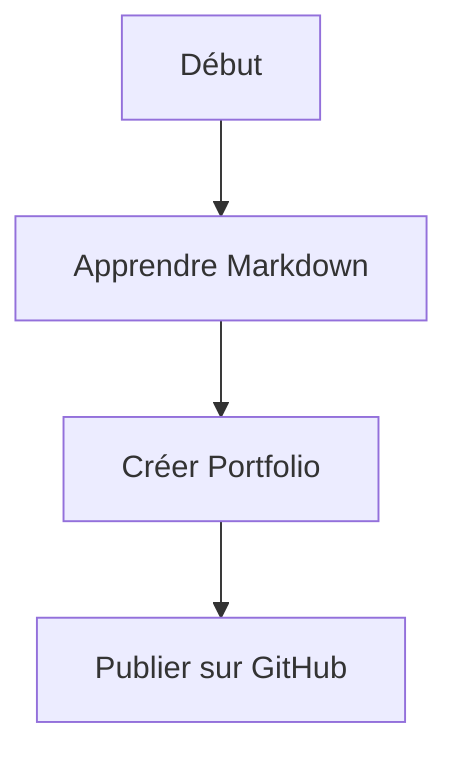

                  td1_Blomy_Antoine.md

# <div align = "center"> INSTITUT UNIVERSITAIRE DES SCIENCES(IUS)"


  ## FACULTE DES SCIENCES ET TECHNOLOGIQUES


###   TD NO 1: ATELIER INFORMATIQUE- Rapport 
          
          


#### PREPARE PAR L'ETUDIANT: BLOMY ANTOINE


#### SOUSMIS AU PROFESSEUR : ISMAEL SAINT-AMOUR


  ###### DATE DE DEPOT: 02 AVRIL 2026  
 </div>
---

## Table des matieres 

[[_TOC_]] .


## INTRODUCTION

## Objectif du TD

Ce travail dirigé a pour objectif de :

- Découvrir les bases du langage Markdown
- Apprendre à structurer un document texte
- Produire un document professionnel
- Convertir un fichier Markdown en plusieurs formats (HTML, PDF, Word)


# Resultats
# Quelques utilitaires telecharges avant de commencer mon travail


## 1. Mise en forme du texte

### Titres

# Titre niveau 1
## Titre niveau 2
### Titre niveau 3

### Styles de texte

- **Texte en gras**
- *Texte en italique*
- ~~Texte barré~~


## 2. Listes

### Liste non ordonnée et imbriquee

  Les etudiants de l'IUS ont de nombreuses qualites:
  - Ils redigent a temps leur devoir
  - Ils participent souvent en cours
    - posent des questions
    - reddigent les TDs

### Liste ordonnée
   Chaque jours, avant de suivre les cours, je fais ce qui suit:
1. Je verifie la connection Internet
2. Je verifie l'electricite
3. Je netttoie l'ecran de mon ordinateur

---

##  3. Liens

[Accéder à mon portfolio sur Github](https://github.com/blomay/blomay/tree/main)


## 4. Image


## 5. Citation

la premiere fois qu'on m'a parle de **Markdown**, quelqu'un m'a dit qu'il est un tres interessant de l'apprendre. il m'a dit que, je cite:
> Markdown est un langage simple et puissant.

## 6. Tableau

| Nom        | Âge | Profession                     |
|------------|-----|--------------------------------|
| Blomy      | 33  | Informaticien informaticien    |
| Jean       | 25  | Étudiant                       |
| Marie      | 30  | Ingénieur                      |
|Marc-Evenort| 33  | Ingenieur informaticien        |

# 3e Partie 

## 1. Liste de tâches cocher 

- [x] Installer VS Code
- [x] Installer les extensions
- [x] Créer le fichier Markdown
- [ ] Finaliser le document
---
# Diagramme de Mermaid



---

## 2. Bloc de code

```html
<div>
  <h1>Bonjour Blomy</h1>
  <p>Ceci est un exemple HTML</p>
</div>
```
---
